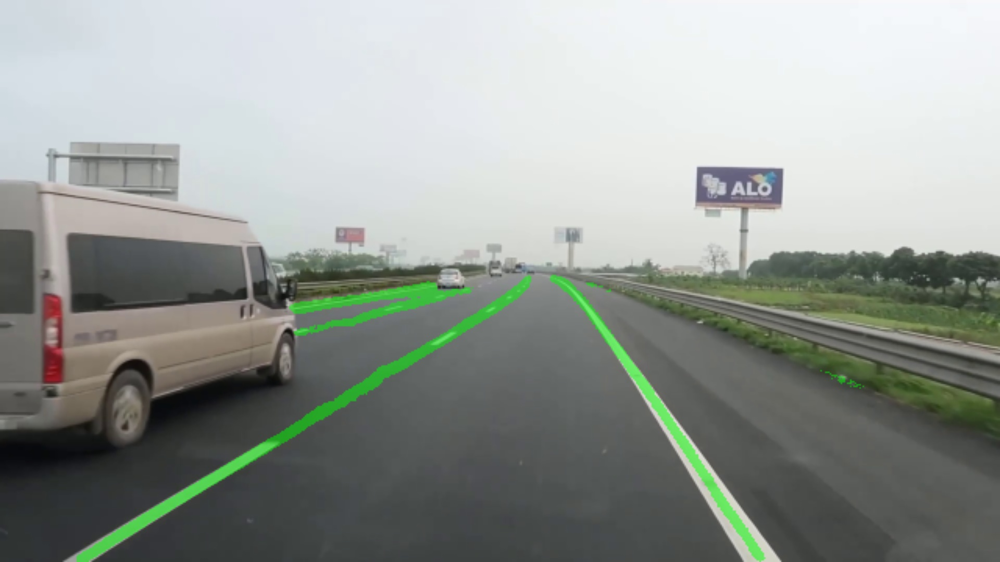

# Lane Tracking and Detection Using YOLOP on RB5 
## Introduction
The project is used to demonstrate the Lane Tracking and Detection on Qualcomm’s Robotics Platform RB5. YOLOP is the architecture used to implement this solution on top of the BDD100K Dataset. The inference is done using SNPE on RB5 with DSP Hardware accelerator, it achieves the performance of 4.15 FPS.
## Prerequisites: 
1. A Linux host system with Ubuntu 18.04. 

2. Install Android Platform tools (ADB, Fastboot) 

3. Download and install the SDK Manager for RB5. Link as given below https://developer.qualcomm.com/software/qualcomm-neural-processing-sdk/tools  

4. Flash the RB5 firmware image on to the RB5 

5. Setup the Network on RB5 using below link https://developer.qualcomm.com/qualcomm-robotics-rb5-kit/quick-start-guide/qualcomm_robotics_rb5_development_kit_bring_up/set-up-network  

6. Setup OpenCV from source for C++ support on RB5. 

7. Install Python3.6 on RB5 
## Steps to Setup the Lane Detection Using YOLOP on RB5

### Installing Dependencies
- OpenCV & Pybind11 installation on RB5
  ``` sh
  ubuntu@ubuntu: adb shell
  sh4.4 # python3 -m pip install --upgrade pip
  sh4.4 # python3 -m pip install opencv-python 
  sh4.4 # apt update && apt install python3-pybind11

  ```
- Setting up the SNPE Libraries on RB5
   1. Copy the SNPE header files & runtime libraries for aarch64-ubuntu-gcc7.5 on RB5 from host system using ADB
  ``` sh
  ubuntu@ubuntu: adb push <SNPE_ROOT>/include/ /data/snpe/include/
  ubuntu@ubuntu: adb push <SNPE_ROOT>/lib/aarch64-ubuntu-gcc7.5/* /data/snpe/
  ubuntu@ubuntu: adb push <SNPE_ROOT>/lib/dsp/* /data/snpe/
  ```
  2. Open the terminal of RB5 and append the lines given below at the end of ~/.bashrc file.
  ```sh
  sh4.4 # export PATH=$PATH:/data/snpe/
  sh4.4 # export LD_LIBRARY_PATH=$LD_LIBRARY_PATH:/data/snpe/
  sh4.4 # export ADSP_LIBRARY_PATH="/data/snpe;/system/lib/efsa/adsp;system/vendor/lb/rfsa/adsp;/dsp"
  ```
    3.	Run the command given below to reinitialize the terminal session 
  ``` sh
  root@ # source ~/.bashrc
  ```
`Note: If device is connected via SSH, please use scp tool for copying the SNPE runtime libraries in /data/snpe folder on RB5.`
    
## Building the SNPE Python Wrapper for Lane Detection Project

1. Clone the project on host system.
```sh
ubuntu@ubuntu: $ git clone <PATH_TO_PROJECT>
```
2. Push the cloned source code from host system to RB5 in the Lane_Detection_YOLOP project directory. 
``` sh
ubuntu@ubuntu: $ adb push <host_system>/<PATH_TO_PROJECT>/ /home/Lane_Detection_YOLOP/
```
3. Navigate to Lane_Detection_YOLOP folder. 
```sh
sh4.4 # cd Lane_Detection_YOLOP
```
4. Run the command below in order to build the shared library for Python wrapper of the SNPE.
``` sh
sh4.4 # g++ -std=c++11 -fPIC -shared -o qcsnpe.so src/qcsnpe.cpp  -I include/ -I /data/snpe/include/ -I /data/snpe/include/zdl/ -I /usr/include/python3.6m/ -I /usr/local/lib/python3.6/dist-packages/pybind11/include -L /data/snpe/ -lSNPE `pkg-config --cflags --libs opencv`
```
5. Above command will generate qcsnpe.so file in the Lane_Detection_YOLOP folder on RB5.

` Note: Give the proper path to qcsnpe.cpp and to other include files.`

## Running the SNPE Python Wrapper for Lane Detection on RB5

1.Open shell of RB5 and create the gstreamer pipeline for the camera using qtiqmmfsrc element for input source.   
```sh
sh4.4 # gst-launch-1.0 -e qtiqmmfsrc name=qmmf ! video/x-h264,format=NV12, width=1280, height=720, framerate=30/1 ! h264parse config-interval=1 ! mpegtsmux name=muxer ! queue ! tcpserversink port=8080 host=localhost 
```
`Note: Please keep running the above pipeline in seperate terminal.`

2.Parallelly in another terminal go to the Lane_Detection_YOLOP project directory on RB5 shell and run the application.
```sh
sh4.4 # cd Lane_Detection_YOLOP
```
**Inference on RB5 using Live Camera Video**
``` sh
sh4.4 # python3 inference.py --vid cam
```
**Inference on RB5 using Recorded Video**
``` sh
sh4.4 # python3 inference.py --vid <video_file_path>
```
## Results


## Custom Training:
In order to train model using your dataset, refer: https://github.com/hustvl/YOLOP/tree/main